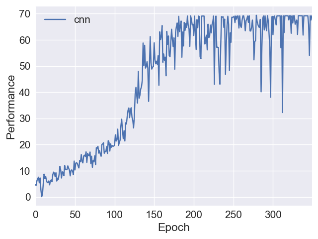

# RL-SuperMarioBros
Training a PPO agent to play Super Mario Bros video game

- run `python train.py` to train your own agent with the specified stage and world.

- run `python eval.py` to visualize the game with the trained agent.

- run `./plot.sh` to visualize the learning curve like this:

  

Till now, I only use the simplest CNN model (same as the basic DQN). I plan to try stronger one, such as IMPALA, in the future.